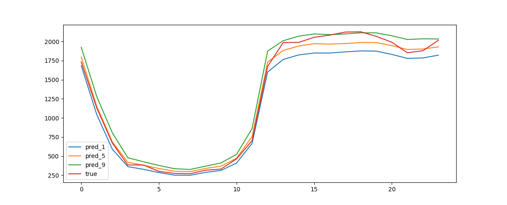

# Temporal Fusion Transformer using PaddlePaddle
### 基于Paddle实现论文: [Temporal Fusion Transformers for Interpretable Multi-horizon Time Series Forecasting](https://arxiv.org/pdf/1912.09363.pdf)
### datasets：[Electricity dataset](https://archive.ics.uci.edu/ml/machine-learning-databases/00321/LD2011_2014.txt.zip)

### You can run it on [aistudio](https://aistudio.baidu.com/aistudio/projectdetail/2335960)

### You can download the best model we have trained from Baidu Pan
* 链接：https://pan.baidu.com/s/1XpOY04lt37NlzcEMM3XZEQ 
* 提取码：zjvu

### The training steps:
* Convert TXT files to CSV files
* We have already provided a csv file [dataset](https://aistudio.baidu.com/aistudio/datasetdetail/106885) on aistudio so you can skip this step

  ``` python
  python scripts/convert_data.py
  ```

* Verifying configuration files

  ```python
  python config/conf.py
  ```

* Verifying dataset

  ```python
  python dataset/ts_dataset.py
  ```

* Training with single GPU

  ```python
  python main.py --exp_name electricity --conf_file_path your_file_path --inference False
  ```

* Inference with best model saved

  ```python
  python main.py --exp_name electricity --conf_file_path your_file_path --inference True
  ```

## 实验结果


### 复现结果

|      | 论文  | tensorflow（源码） | paddlepaddle |
| ---- | ----- | ------------------ | ------------ |
| P50  | 0.055 | 0.056          | 0.054     |
| P90  | 0.027 | 0.030          | 0.028     |


## 参考资料
- [google-research/tft](https://github.com/google-research/google-research/tree/master/tft)
- [stevinc/Transformer_Timeseries](https://github.com/stevinc/Transformer_Timeseries)
